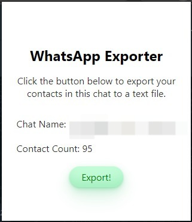

# WhatsApp Group Contacts Exporter

📋 The WhatsApp Group Contacts Exporter is a Chrome extension that allows you to export contacts from a WhatsApp group. It exports the phone numbers to a text file.

## Usage

1. 📥 Download this repository as a ZIP file by clicking on the "Code" button above and selecting "Download ZIP."
2. 💾 Extract the ZIP file to a location on your computer.
3. 🔧 Open Google Chrome and go to the extensions page by entering "chrome://extensions" in the address bar.
4. ✅ Enable the "Developer mode" toggle switch in the top right corner of the extensions page.
5. 📂 Click on the "Load unpacked" button and select the folder where you extracted the ZIP file.
6. ✔️ The WhatsApp Group Contacts Exporter extension should now be installed and ready to use.

## Preview

